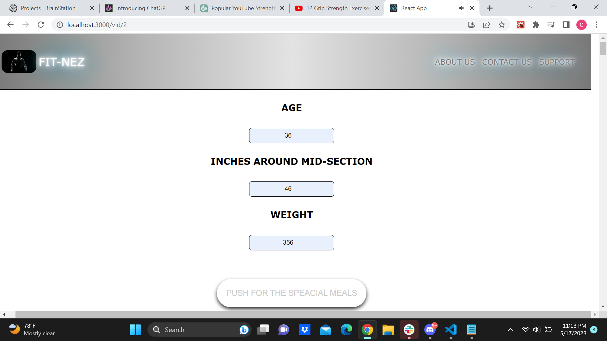
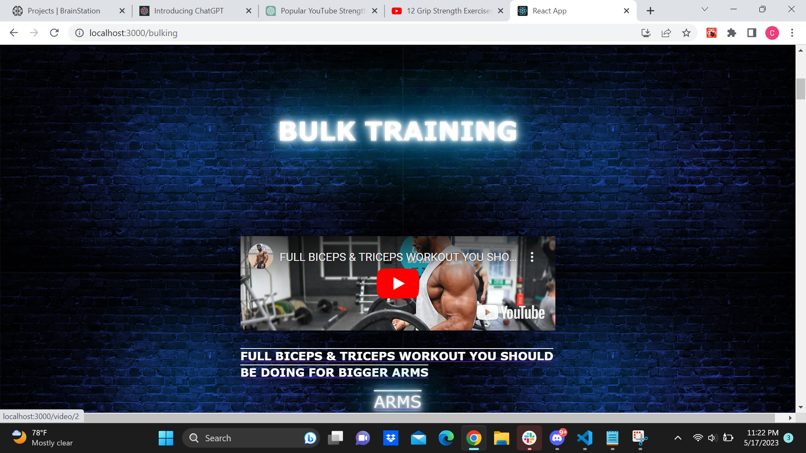

# Getting started with FIT-NEZ app

FIT-NEZ
`Tech Stack and APIs`

The project utilizes the following technologies and APIs:

React
Express
OpenAI API

## Features and Usage Instructions

The project offers the following features:

Bulking or strength training: The application provides options for users to choose between bulking or strength training programs.

Meal Plan Generation: By making a call to the OpenAI API, the application generates a complete meal plan from Monday to Sunday. Users can view and select their desired meal plan.

Workout Video Selection: Users can choose a workout video from a list of available options. Clicking on the desired video will navigate them to the bottom of the page where the selected video will be ready for consumption.

Usage Instructions:

Start on the home page.
Select either "Bulk" or "Strength" training option.
Enter your metrics (e.g., weight, height) on the second page.
Send the metrics to the artificial intelligence system.
Choose a workout video from the provided list.
It will automatically scroll down to view and consume the selected video.

## Installation

To install the project in both developer and production environments, follow the steps below:

Open a terminal or command prompt.
Navigate to the project's root directory.
Run the following command to install dependencies:
Copy code

### `npm install`

Once the installation is complete, start the application by running the following command:

### `npm start`

The application should now be accessible via the specified URL.

## API References

The project integrates with the OpenAI API. For more information on the API and its endpoints, refer to the OpenAI API documentation.

## Screenshots

Screenshots here to visually showcase the application's interface and features.

## Lessons Learned & Next Steps

During the development of this project, several key lessons were learned. These include:

Efficiently integrating external APIs can enhance the functionality and user experience of the application.
Proper planning and design can simplify the development process and improve code maintainability.
Testing and quality assurance are crucial for identifying and resolving issues before deployment.

Next Steps:

Enhance the user interface and overall design for a more visually appealing experience.
Improve error handling and implement robust error reporting.
Optimize performance to ensure smooth and responsive user interactions.
Conduct additional testing and gather user feedback for further improvements.
Feel free to contribute to this project by suggesting additional features, reporting issues, or submitting pull requests.
